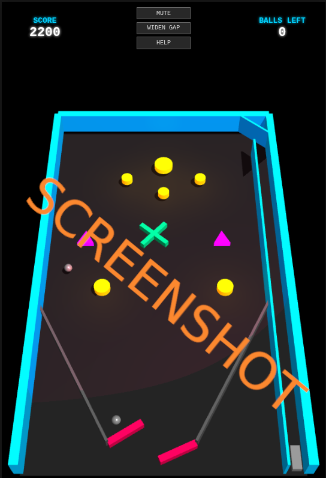

# js_flipper_redux_tree

# 3D Physics Pinball 🎱

**3D Physics Pinball** is a browser-based pinball game featuring
**Planck.js** physics and **Three.js** 3D rendering.
The project combines realistic ball dynamics, flippers, bumpers, lights,
shadows, and a full UI system with buttons, scoring, game over logic,
touch controls and bot mode.

## Play it now: https://pemmyz.github.io/js_flipper_redux_tree/

------------------------------------------------------------------------



## 🚀 Features

### 🧱 Physics & Gameplay

-   Realistic 2D physics using **Planck.js**
-   3D visuals using **Three.js**, shadows enabled
-   Fully working **flippers**, **launcher**, **bumpers**, and
    **obstacles**
-   Ball loss detection, multi-ball handling, and scoring
-   Adjustable **flipper gap**
-   **Bot mode** for auto‑play

### 🌓 Interface & Controls

-   Light/Dark theme toggle
-   Touch-screen controls:
    -   Left flipper
    -   Right flipper
    -   Launch ball
-   Desktop controls:
    -   **Left Arrow** -- Left flipper
    -   **Right Arrow** -- Right flipper
    -   **Spacebar** -- Charge + launch
    -   **M** -- Mute
    -   **G** -- Widen flipper gap
    -   **H** -- Help menu
    -   **B** -- Bot mode
-   Game Over screen + Restart button

------------------------------------------------------------------------

## 📁 Project Structure

    index.html      - Main HTML layout
    style.css       - UI & layout styles
    script.js       - Game logic, physics, rendering

------------------------------------------------------------------------

## 🛠️ Technology Stack

-   **Planck.js** (Box2D physics engine)
-   **Three.js** (3D rendering engine)
-   HTML5 / CSS3 / JavaScript
-   Web Audio API for sound effects

------------------------------------------------------------------------

## ▶️ How to Run

Just open **index.html** in any modern web browser:

-   Chrome
-   Firefox
-   Edge
-   Opera

(Recommended: Chrome for best WebGL + Audio performance)

------------------------------------------------------------------------

## 🔧 Customization

You can modify physics constants inside `script.js`:

``` js
const CONFIG = {
    pixelsPerMeter: 30,
    gravity: 15,
    colors: { ... }
};
```

Or tweak materials, meshes, lights, and playfield layout.

------------------------------------------------------------------------

## 📄 License

MIT License.
Free to modify, distribute, or use in your own projects.

------------------------------------------------------------------------

Enjoy the game! 🎮
